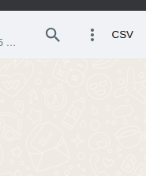

# Extensão chrome
## Extensao chrome

I think I did it in the simplest way so that after "installing" the extension, the CSV symbol will appear in the top right corner, just like in the image

After clicking, it will download a CSV file to your machine containing all the numbers of a WhatsApp group

- Email: viktorariel777@gmail.com
- Linkedin: [Viktor Ariel](https://www.linkedin.com/in/viktor-ariel/)

Enjoy
 
 

<h1>pt-br</h1>

Acho q fiz da maneira mais simples pra poder usar depois de "instalar" a extensão vai aparecer o simbolo de CSV no canto superior direito, igual na imagem

Depois de clicar ele vai baixar um arquivo CSV para sua máquina contendo todos os numero de algum grupo do whats

 

- Email: viktorariel777@gmail.com
- Linkedin: [Viktor Ariel](https://www.linkedin.com/in/viktor-ariel/)

Enjoy

